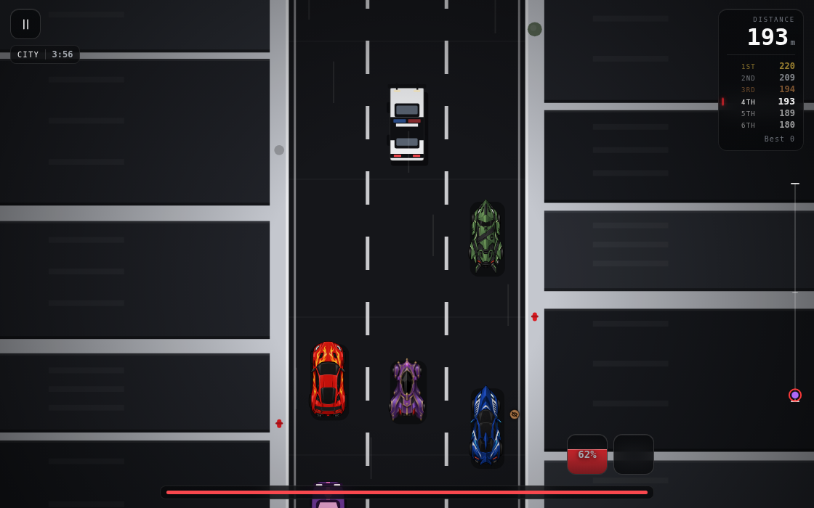
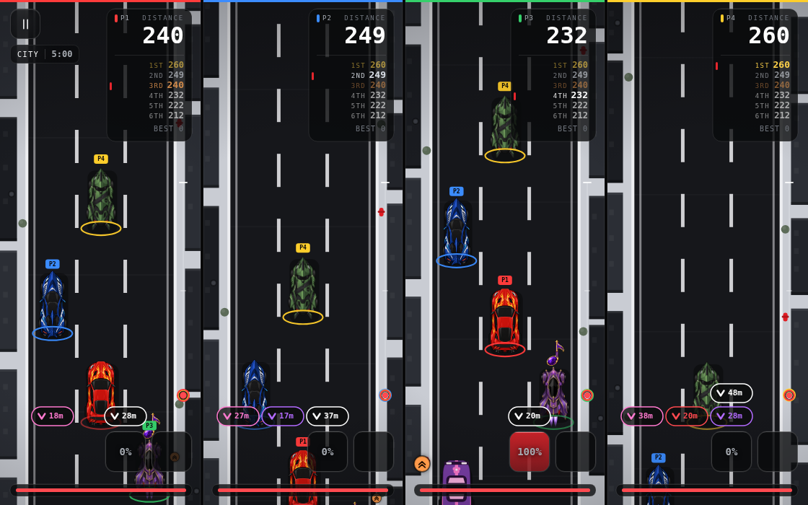
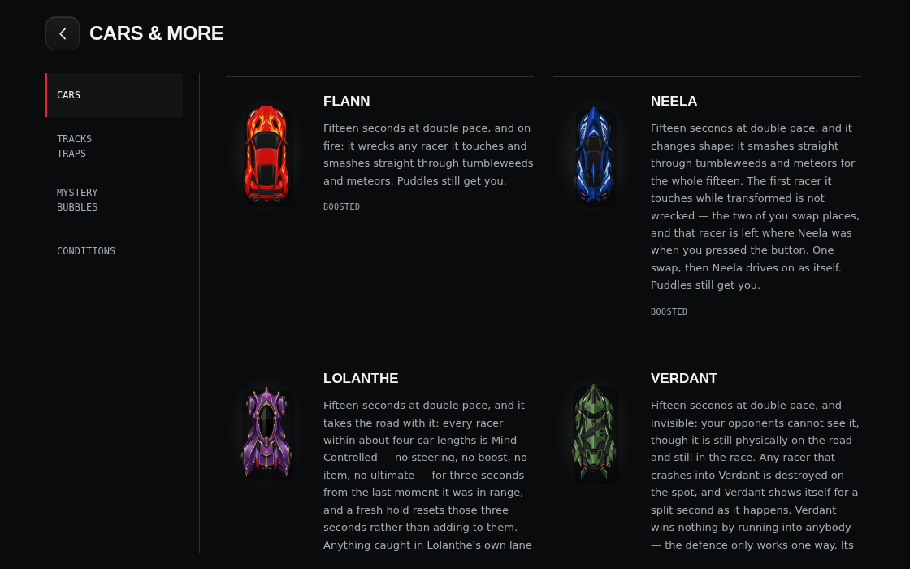

# SEREN

A three-lane arcade racer that runs in a browser tab. Six cars, each with its own
ultimate, race up a road that never stops speeding up — through a city, a desert
and a rainbow strip of deep space — dodging puddles, meteors and tumbleweeds,
grabbing items out of mystery bubbles, and barging each other into the barriers.

No install, no build step, no dependencies. One HTML file, one stylesheet and
fifteen JavaScript files, drawn entirely with hand-written Canvas 2D.

**▶ [Play it](https://hiyroscript.github.io/seren/)** · a game by hiyroscript

---

## Contents

- [Playing](#playing) · [Controls](#controls) · [Modes](#modes)
- [The cars and their ultimates](#the-cars-and-their-ultimates)
- [Driving](#driving) · [Contact rules](#contact-rules)
- [The road](#the-road) · [Hazards](#hazards) · [Mystery bubbles and items](#mystery-bubbles-and-items)
- [Conditions](#conditions) · [Race structure](#race-structure) · [Difficulty](#difficulty)
- [Local multiplayer](#local-multiplayer) · [Settings and saved data](#settings-and-saved-data)
- [Accessibility](#accessibility) · [Browser support](#browser-support)
- [Running it locally](#running-it-locally) · [Project layout](#project-layout) · [Deploying](#deploying)
- [Known quirks](#known-quirks)

---

## Playing

Open the page, pick a language the first time, then **Start race**. Pick a mode,
pick a car, and the lights go out three seconds later.

**Cars & more** on the home screen is the reference: every car's ultimate, every
track, every trap, the mystery-bubble drop odds, and what each Condition means.
It is the in-game manual and it is built from the same tables the race reads, so
it can never drift out of date.



The HUD, clockwise from the top left: the track name and race clock; the distance
you have covered and the six-car standings, with your row picked out; a ladder
down the right showing how far ahead or behind each racer is; your ultimate meter
and item box bottom right; your own Conditions as a column of coloured icon
circles bottom left; and the boost bar across the foot. Racers off the top or
bottom of the screen get an edge badge with their lane and the gap in metres —
or, past 500m, a pair of chevrons on the ladder.

## Controls

### Keyboard

| Key | Does |
| --- | --- |
| `←` `→` or `A` `D` | change lane (and barge whoever is in it) |
| `↑` or `W` — hold | boost |
| `Shift` or `Space` | ultimate |
| `E` | use the item you are holding |
| `P` or `Esc` | pause / resume |
| `Space` / `Enter` on a menu | take the obvious next step (and pick a random car on the car sheet) |

### Touch and mouse — on the canvas

| Gesture | Does |
| --- | --- |
| swipe left / right | change lane — a held drag keeps stepping across |
| swipe up and hold | boost |
| press and hold one finger (0.35s) | ultimate |
| double-tap (within 0.5s) | use the item |
| tap the ultimate square / item box | ultimate / use item |

The boost swipe latches until the finger comes off, so the travel you have
already spent does not keep counting against the next lane change. The ultimate
needs **one** finger held — a second finger on the glass suppresses it.

### Controller — local play

Browsers report a "standard" mapping for PlayStation, Xbox and most third-party
pads alike, so one table covers all of them.

| Control | Does |
| --- | --- |
| left stick ← / → (or d-pad) | change lane |
| right stick held up (or d-pad up) | boost |
| both sticks clicked in (L3 + R3 / LS + RS) | ultimate |
| R2, or Circle (Xbox: RT, or B) | use the item |
| Options (Xbox: Menu) | pause |
| Cross / Options on a panel | resume, or race again |
| Circle on a panel | leave the race |

Everything is edge-triggered off a per-player snapshot of the previous frame, so a
held trigger fires once and a held stick walks across the lanes at a readable pace.

## Modes

**Endless** — no finish line. Five bots on the road with you and a road that keeps
getting faster. Drive as far as you can; leaving the race banks the distance as
your personal best.

**Race against bots** — pick a difficulty, then race the full distance: five
minutes, then three track changes, then 900 metres to the flag. Six cars, every
trap, every pickup, and a finishing order at the end.

**Local play** — two to four people on one screen, one controller each, on a
computer. The screen splits into equal columns and the bots fill whatever seats
are left, so it is always a six-car field. Local play is offered on phones but
greyed out with the reason, because it needs a keyboard-and-mouse machine with
pads attached.

Local play then asks how you want to race:

- **Standard play** — the full game, with a difficulty for the bots.
- **Custom play** — set the road up your way: how many bots (from none up to
  however many seats the people leave free), and whether traps, mystery bubbles,
  boost, and ultimates are on the table at all.

Backing out of a custom setup and choosing standard restores the defaults, so you
never inherit half a custom race by accident.

## The cars and their ultimates

Every car has the same mechanical ultimate: a **75-second charge**, then
**15 seconds at 2× its own pace**, with no additional powers. Difficulty changes
when a bot spends the boost, never its strength, duration or charge rate.

| Car | Ultimate effect |
| --- | --- |
| **Flann** | 15 seconds at 2× pace |
| **Phantom** | 15 seconds at 2× pace |
| **Bolt** | 15 seconds at 2× pace |
| **Timestamp** | 15 seconds at 2× pace |
| **Rose** | 15 seconds at 2× pace |
| **Siren** | 15 seconds at 2× pace |

### The ultimate meter

- **75 seconds** from empty to ready, for every car in the field.
- Hitting a **trap** costs 5%; being **wrecked** costs 10%; **wrecking somebody
  else** pays 10% of the charge meter.
- During activation the meter counts down the fixed **15-second** duration.
  Charge rewards and penalties do not alter this countdown, and another press
  does nothing. A wreck or finishing the race ends an active ultimate.
- Custom play can disable ultimates for every driver.

### How ultimates interact

Ultimates do not change contact rules. An active racer simply moves at boosted
pace and otherwise interacts normally: collisions, barges, wrecks, hazards,
oil and seekers still apply. Slowed and other legitimate debuffs coexist with
the speed multiplier. Only **Boosted** is added to the Conditions on show, with
ordinary boost flames and a generic activation burst.

## Driving

**Lanes.** Three of them. Changing lane into an occupied one is a barge: if the
other car has room it is shoved across and left labouring; if it is already
against a barrier, the hit wrecks it. Either way the lane is yours.

**Boost.** A full bar lasts about 2.5 seconds at 1.5× pace and takes about 7
seconds to refill. Run it completely dry and it locks out until it is full again.
It will not run while you are wrecked.

**Rear-ending.** Running into the back of the car in front shunts it forward for
0.8 seconds at 1.35× while you are left labouring. Both cars lose the same time
to the bump, and the shunt shows on the shunted car as **Boosted**.

**Wrecks.** Being destroyed parks you for 3 seconds, then respawns you
**Invulnerable** for 2 more. That is total — every debuff, hazard, trap and
attack — and it phases, so you pass through anything that would otherwise meet
you.

### Contact rules

A car does not make road contact when it has finished, is wrecked, or is
Invulnerable from a respawn. An ultimate grants none of these protections.

Finishing is not a Condition and it is not temporary Invulnerability: it is a
race lifecycle state. The instant a car crosses the line it is out of play for
the rest of that race. Nothing selects it as a target, nothing tracks it,
nothing collides with it, and no debuff, item, hazard or seeker can alter the
result it has earned — a seeker already locked on gives the mark up and burns
out. All it does from there is roll out onto its parking mark.

## The road

Three tracks, swapping every 60 seconds. Where two meet, the ground interlocks
along a wandering seam rather than butting up against a line, and the driving
surface fades over a stretch rather than at a step.

| Track | Looks like | Hazard |
| --- | --- | --- |
| **City** | Dark asphalt between pale rooftops, water tanks and helipads. White lane dashes, crosswalks and red hydrants along the kerb. | Puddle |
| **Desert** | Sand-coloured ground and layered rock, cacti and scrub on the shoulders. Sand drifts across a dark road under faded yellow markings. | Tumbleweed |
| **Rainbow space** | A road of scrolling rainbow bands over near-black, edged with neon cyan rails. Nothing beside it but a drifting starfield. | Meteor |

The road speeds up **5% every 30 seconds, up to double** — so it tops out ten
minutes in.

### Hazards

| Hazard | Track | What it does | Ultimate cost |
| --- | --- | --- | --- |
| **Puddle** | City | Water over your screen: **Obscured** for 2.6 seconds | −5% |
| **Meteor** | Space | A blinking red ring marks the impact. Anything in the blast is destroyed and respawns after 3 seconds | −10% |
| **Tumbleweed** | Desert | Rolls across from either side; halves your speed for 1.7 seconds | −5% |

The meteor's ring is a spot on the *road*, not on your screen, and how long the
rock has left is measured in seconds — so it lands where it was always going to
land no matter what you do to your own speed. Every ultimate leaves the
world clock and other racers’ speed unchanged.

The seeker clears hazards it passes through.

### Mystery bubbles and items

Three bubbles drift across the road together, a row every 5,400–8,600 road units.
Touch one for a random item and take as many of the three as you can reach — each
new one **replaces** what you hold, and a trade flashes the box so a silent swap
still reads.

| Item | Rarity | Drop | Leading | What it does |
| --- | --- | --- | --- | --- |
| **Boost can** | Common | 66.7% | 70.6% | 2.2 seconds at 1.55× that does not touch your boost meter |
| **Oily oil** | Rare | 27.8% | 29.4% | Drops a slick behind you for 15 seconds. The first racer to touch it loses all grip for 4 seconds — reversed steering — and takes the slick with them |
| **Seeker** | Legendary | 5.6% | — | A missile that hunts the leader, destroying whatever it passes through |

The seeker never drops for whoever is leading; out in front, its share goes to the
other two. Invulnerability, a wreck and the finish flag stop a seeker hit; an
ultimate does not.

A row does not sit there forever. It flashes and goes on whichever comes first:
the last stretch before it drops off the bottom, or a 30-second clock that only
runs when the road has all but stopped.

## Conditions

Five of them, and each one is a small filled circle in its own colour with a
plain device inside it. The shape carries the meaning as much as the colour
does, so a Condition is never told apart by colour alone.

| Condition | | Colour | Icon | Meaning |
| --- | --- | --- | --- | --- |
| **Boosted** | buff | `#FF9A4A` | forward chevrons | Anything making you go faster, whatever put it there: the boost meter, a boost can, an ultimate, or a rear-end shunt |
| **Invulnerable** | buff | `#FFD86B` | shield | Respawn protection: pass through road contact and refuse every debuff |
| **Slowed** | debuff | `#8A9099` | arrow brought down to a floor | Anything making you go slower, whatever put it there |
| **Obscured** | debuff | `#B07A4A` | crossed-out eye | Water from a puddle over your screen |
| **Skidded** | debuff | `#0B0B0C` | paired skid marks | No grip: left goes right and right goes left |

**Where they are shown.** Every visible car that is *not* the owner of the view
you are looking through wears its Conditions as a compact column of these
circles beside it — bots and other people alike, because what decides is the
racer's state and never who is holding the controls. Your own car never carries
them: yours go in the bottom-left corner of the HUD instead, as the same
circles. In split screen this is worked out per column, so in Player 2's window
Player 2 has corner badges and everyone else has beside-car ones, and in Player
1's window Player 2 is a rival and gets beside-car badges like anybody else.

Where several are active they stack in a fixed order — Invulnerable, Boosted,
Slowed, Obscured, Skidded — so a stack never reshuffles between frames.

**Invulnerable** clears the debuffs already on you and refuses new ones for as
long as it lasts. Activating an ultimate leaves every Condition in place.

A racer that has crossed the line shows no Conditions at all: it is out of the
race, not protected within it. The garage's **Conditions** tab is where the
symbols are learned — Buff and Debuff on two sub-tabs, each card carrying the
same circle you see on the road.

## Race structure

**Endless** has no finish line — it runs until you leave.

**Race against bots** and **local play** run to a flag:

```
0:00 ─────────── 5:00 ──────── track ── track ── track ── +900m ── 🏁
     five minutes           three track changes      the last stretch
```

When the third track change lands, the flag is planted 900 metres ahead. Cars
cross, are given a place, and roll out onto a staircase of marks past the line —
first place furthest, each place behind stopping one step earlier, in alternating
lanes — so the field parks in the order it finished. Finishers are out of play
entirely: nothing can target or touch them.

On one screen the race ends when your car crosses. On four it ends when the last
*person* crosses; bots still on the road finish behind, as they always do.

## Difficulty

A difficulty is **not** a multiplier on anything the car does. Every setting
drives the same car at the same pace off the same charge clock. What changes is
how well the driver *thinks*.

| | Easy | Medium | Hard | Brutal |
| --- | --- | --- | --- | --- |
| Misses trouble in its own lane | 52% | 26% | 10% | 3% |
| Reaction time | 0.70–1.40s | 0.35–0.75s | 0.18–0.42s | 0.07–0.22s |
| Reconsiders the race every | 0.50–0.95s | 0.34–0.68s | 0.22–0.46s | 0.14–0.30s |
| Reads hazards this much further ahead | — | 110 | 250 | 380 |
| Projects other cars forward | — | 0.35s | 0.80s | 1.30s |
| Overall competence | 0.14 | 0.46 | 0.80 | 1.00 |
| Picks targets deliberately | 0.10 | 0.42 | 0.78 | 1.00 |
| Defends its place | 0.06 | 0.36 | 0.72 | 1.00 |
| Values items and ultimates | 0.10 | 0.46 | 0.82 | 1.00 |
| Decision left to chance | 50% | 26% | 11% | 3.5% |

In practice: **Easy** is slow to spot trouble and happy to let you by. **Medium**
races you fairly and takes a lane when it needs one. **Hard** blocks, barges and
times its ultimates well. **Brutal** misses nothing, defends every lane, and
wrecks you if it can.

On top of difficulty, each car has a **temperament** — nerve, spite, patience
and guard — that is jittered at the start of every race, so five bots on one
setting are not the same bot five times, and the Flann you raced last time is not
quite this one.

Bots only ever *decide*. The doing is handed straight back to the same functions
your own inputs call, so a bot barging, dropping oil or spending an ultimate is
running your mechanic, not a copy written for bots.

## Local multiplayer



Two to four people, one controller each, on one computer. The flow is: player
count → controller discovery → standard or custom → difficulty (or the custom
sheet) → each player picks a car in turn with their own pad → race.

- The screen splits into equal columns, one per person. Each column is a full
  game — its own camera, its own instruments — and the world is built wide enough
  to cover the whole spread of the field, so a player half a screen up the road
  is not driving through nothing.
- The field is always **six cars**. Bots fill whatever seats the people leave.
- Every human car wears a coloured ring on the road, and the cars that are not
  yours wear a numbered flag, so two players in identical positions on two
  columns can still be told apart.
- Cars are picked one at a time and a car already spoken for is dead on the board
  for everyone after. Backing out undoes one pick at a time.
- **If a controller drops out mid-race the whole race pauses**, every car lets go
  of everything it was holding, and the panel says whose pad it was. Reconnect it
  and carry on.
- Local play reads the personal best but never writes it — four people on one
  machine do not share a record.

## Settings and saved data

The sliders icon in the top right of the home screen opens **Settings**, a panel
over the moving road with every preference in it:

| Group | Setting | Does |
| --- | --- | --- |
| General | Language | English or Français, applied to the whole interface as you press it — the panel included, and without a reload |
| Audio | Sound | On or off, the one switch for every sound the game makes |
| Audio | Master volume | 0–100%, straight on to the master gain, live |
| Accessibility | Reduced motion | System / Reduced / Full |
| Accessibility | High contrast | System / On / Off |
| Interface | Show control hints | The keyboard row along the bottom of the home screen |

At the foot is **Restore default settings**, which asks once and then resets
those preferences only — your language and your personal best are kept.

Six values in `localStorage`, and nothing else is ever written:

| Key | Holds |
| --- | --- |
| `seren.lang` | `en` or `fr` |
| `seren.sound` | `1` or `0` |
| `seren.volume` | `0`–`100`, default `90` |
| `seren.motion` | `system`, `reduced` or `full` |
| `seren.contrast` | `system`, `on` or `off` |
| `seren.controlHints` | `1` or `0` |
| `seren.best` | your furthest distance, in metres |

Existing saves from the previous name are copied from `redline.*` on startup
when the corresponding `seren.*` value is absent. Existing Seren values take
priority, and the old keys remain as a backup. All new saves use `seren.*`. A
saved value that is not one of the ones listed above — an older build, a hand
edit — falls back to its default rather than reaching the game.

If `localStorage` is unavailable — a private window, blocked site data — the game
falls back to an in-memory store and keeps working for the session.

**Language.** English and French. The first visit asks before anything else;
after that it lives in Settings.

**Sound.** All generated with the Web Audio API — no audio files. The context is
created lazily on your first interaction, so browsers never refuse it for starting
outside a user gesture. Everything plays through one master gain, which is the
volume when sound is on and silence when it is off.

## The interface

One system, from the splash to the finish line, built on four things:

- **Black, white, grey, red.** The ground is near-black, the type is white
  through a tight neutral ramp, and red is the only accent — the primary action,
  the selected step, the charge in the ultimate square, the tick beside your own
  row in the standings. Colours that mean something in the game — the four seat
  colours, gold/silver/bronze in the running order, the rarity of a pickup, the
  five Condition colours — stay, because they are the game speaking and not the
  interface decorating.
- **Glass for anything elevated.** Dialogs, panels, the countdown plate
  and every instrument over the road use one recipe: a dark tonal fill, a blurred
  backdrop, a hairline edge and a highlight along the top. Where a browser cannot
  blur, the same surfaces go opaque instead of translucent, so readability never
  depends on the effect. Nothing else is glass — the hierarchy from ground to
  surface to control to overlay is what the treatment is for.
- **Five type roles and no more.** Archivo for display and actions, IBM Plex Sans
  for copy, IBM Plex Mono for metadata and every readout. Numbers are tabular
  everywhere they can change.
- **One geometry.** A single radius scale, a single spacing scale, and one focus
  ring — a white outline over a dark halo, so it is visible on glass, on red and
  on the moving road alike.

Menus use distinct compositions: an angled scrolling road and oversized wordmark
on Home, three mode destinations, a numbered difficulty scale, equal-column
player previews, live controller bays, a rule workbench, and a car showroom.
The showroom uses the actual car renderer; hovering or focusing inspects a car,
and choosing it keeps the original direct-pick behavior. Local setup displays
the player roster and current configuration. Cars & More uses a reference index
with keyboard-operable tabs. Setup occupies the viewport; the game retains its
original race layout.

The race HUD is the same system rather than a second one. The corners hold what
you consult: the pause button and the track and clock top left, distance and the
running order top right. The bottom holds what you spend: the boost meter in its
tray, your Conditions as a column of icon circles on the left, the ultimate and
item squares on the right. On a wide window that bottom band closes in on the road
instead of stretching to the far corners, so it stays in peripheral vision. The
ultimate square fills from the foot as it charges, so the reading is a shape
before it is a number.

Local play draws the same instruments on the canvas, once per column, from the
same constants — see
[the HUD section of ARCHITECTURE.md](docs/ARCHITECTURE.md#hudjs).

## Accessibility

- **Reduced motion.** `prefers-reduced-motion: reduce` flattens the page's
  animations, and Settings can overrule it either way — Reduced stills the
  interface on a device that never asked, Full restores the animation for a
  player who would rather have it. Things drawn frame-by-frame on the canvas sit
  outside CSS, so they ask the same resolved answer — the item-box swap flash, for instance,
  becomes a brightness pulse with the box held still. Every state that is
  normally carried by movement also has a still form: a charged ultimate stays
  red, your row in the standings stays ticked, a Condition badge appears without
  animating in.
- **Never colour alone.** Every Condition carries a distinct icon as well as its
  colour and is named on its garage card — the in-race badge is icon-only but
  carries its name as an accessible label — your
  own row in the running order carries a red tick as well as full brightness, a
  car already chosen by another player is struck through as well as dimmed, and
  the difficulty levels are four bars filled to the level rather than four shades.
- **Keyboard.** Everything is a real `<button>`, the focus ring is visible on
  every surface, and a screen that is not showing is hidden outright rather than
  faded — so nothing invisible sits in the tab order. Setup makes the home
  screen behind it `inert`, and a pause or a result makes the instruments
  `inert`, so tabbing cannot walk out of the thing in front of you.
- **Language.** Every string in the interface is translated, including the
  reference pages, every setting and its description, and the `aria-label` on
  every icon-only control — pause, back, close, settings, and the two squares you
  spend.
- **Touch.** Every target is at least 40px on its short side, the two HUD squares
  are 56px, and the layout pads itself out of the safe-area insets on all four
  sides.
- **Contrast.** `prefers-contrast: more` firms up the hairlines, the secondary
  ink, the hover and selection washes and the glass — and High contrast in
  Settings applies the same treatment on demand, or turns it off. The palette
  does not change: black, white, grey and red, worked harder.
  `forced-colors: active` falls back to system colours with real borders.
- **Desktop scaling.** Menus use the full viewport and adapt their compositions
  to its width and height. The race retains its original portrait shell scaling
  and landscape layout, with a matching Canvas backing store.
- **Orientation and resize.** The world scales off the viewport *height* against a
  portrait phone as the reference, which is what keeps both orientations the same
  game: a short landscape viewport draws a smaller road and smaller cars, so the
  stretch of road in front of you, measured in car lengths, comes out identical.
  Below 480 points of height the standings panel tightens and the bottom row
  pulls in, on the page and in a split-screen column alike.

## Browser support

Any current desktop or mobile browser. The game uses Canvas 2D, Pointer Events,
Web Audio, the Gamepad API, `matchMedia` and `localStorage`, and degrades
gracefully where newer features are missing — `roundRect`, `ellipse`, `Path2D`
and canvas `letterSpacing` all have hand-written fallbacks, `backdrop-filter` has
an opaque one, and a browser without `inert` simply keeps the older tab order.

Local play needs a device that reports `(hover: hover) and (pointer: fine)` — a
computer — plus a controller per player.

## Running it locally

There is nothing to install and nothing to build. Any static file server will do:

```sh
git clone https://github.com/hiyroscript/seren.git
cd seren
python3 -m http.server 8000
# then open http://localhost:8000
```

Opening `index.html` straight off the filesystem mostly works, but a server is
better — some browsers restrict `localStorage` and canvas reads on `file://`.

To edit: change a file, reload the page. That is the whole loop.

### Checking your changes

Because there is no build step, nothing normally catches a typo'd selector, a
translation key that does not exist, or a second `const` with a name another file
already used — the first two do nothing visible until you open the screen that
uses them, and the third kills the page on load. One script finds all of it:

```sh
node tools/check.mjs
node tools/menu-check.mjs
node tools/ultimate-check.mjs
```

It is plain Node with no dependencies — there is no `package.json` and nothing to
install — and it exits non-zero on failure, so it drops into a git hook or a CI
job unchanged. It verifies:

- every stylesheet and script in `index.html` exists, is deferred, and is in the
  documented dependency order, with no inline `<style>` or `<script>` left behind
- every JavaScript file parses
- every top-level name is unique across all fifteen files, and none shadows a
  browser global
- every literal `#id` selector in the JavaScript resolves to an element that
  exists in `index.html`
- every string has all its languages, and every `data-i18n` attribute and literal
  `t("…")` call resolves to a string that exists
- every car has a draw branch, a name, an ultimate description, a button, a
  select-screen canvas; every Condition has a name, a description, a unique
  colour and one piece of icon artwork, and lands on the right Buff/Debuff page;
  no trace of the removed launch mechanic survives anywhere in the source or the
  page; every item has artwork and a valid rarity

Run it before you commit. It takes well under a second.

`node tools/menu-check.mjs` also checks menu state and event wiring using
DOM/Canvas test doubles, including localization, every Settings preference and
what it reaches, setup, simulated controllers, car turns and pause/results. Browser visuals and hardware still need separate
checks; see [the redesign QA record](docs/MENU-REDESIGN-QA.md).

## Project layout

```
index.html          the document shell — screens, canvases, SVG icons, script tags
css/app.css         the entire stylesheet
v_flann.PNG         Flann’s image-backed vehicle, shared by menus and races
js/                 the game, in load order (see below)
tools/check.mjs     dependency-free validator for the invariants below
docs/               ARCHITECTURE.md, TUNING.md and the screenshots
upd                 the current brief
.nojekyll           tells GitHub Pages to serve the tree verbatim
```

The fifteen scripts load in a fixed, dependency-safe order with `defer`, so each
may rely on the ones above it and nothing starts before every declaration exists.

| File | Owns |
| --- | --- |
| `core.js` | storage with a memory fallback, the small maths/DOM helpers, capability flags |
| `i18n.js` | every string, the current language, and the sweep that writes them into the page |
| `data.js` | cars, difficulties, temperaments, conditions, items, tracks and every tuning constant |
| `audio.js` | the lazily-created Web Audio context, tones, noise, engine |
| `runtime.js` | canvas and context, road and split-view geometry, the game state object, layout/resize |
| `ui.js` | screen switching and focus gating, garage, custom setup, the car board, select-screen art |
| `settings.js` | every player preference, where it is stored, what applies it, and the Settings dialog |
| `local.js` | seats, player colours, pad discovery, the menu pad loops |
| `ai.js` | the bot mind: sense, weigh, act |
| `mechanics.js` | contact, lanes, boost, wrecks, Conditions, ultimates, items, hazards, particles |
| `race.js` | world seeding, the grid, the lifecycle, the finish, the per-frame update and frame loop |
| `render.js` | all Canvas 2D drawing |
| `hud.js` | the DOM HUD, the condition badges and their icons, the per-seat canvas HUD and the constants they share |
| `input.js` | keyboard, pointer and controller, translated into mechanics calls |
| `main.js` | boot: initial paints, event wiring, splash, settle |

**[docs/ARCHITECTURE.md](docs/ARCHITECTURE.md)** goes through how it fits together
and where to change what. **[docs/TUNING.md](docs/TUNING.md)** is every dial in one
place.



## Deploying

It is a plain static site with relative asset paths, so it works under any base
path. This repository is served by GitHub Pages from `main` — push, and the
`pages-build-deployment` workflow republishes it. Any static host works the same
way: copy `index.html`, `v_flann.PNG`, `css/` and `js/` and you are done.

## Known quirks

- **Endless runs until you leave.** The road contains your car and five racer bots,
  with hazards and items providing the obstacles.
- **The internals are reachable from the console.** The game runs as ordered
  classic scripts rather than inside a closure, so `G`, `CARS`, `startUlt` and the
  rest are global. Handy for debugging, and it means a determined player can poke
  the state. The only persisted value, the personal best, was always one
  `localStorage.setItem` away regardless.

## Credit

A game by **hiyroscript**. No license file is present, so default copyright
applies until the author adds one.
