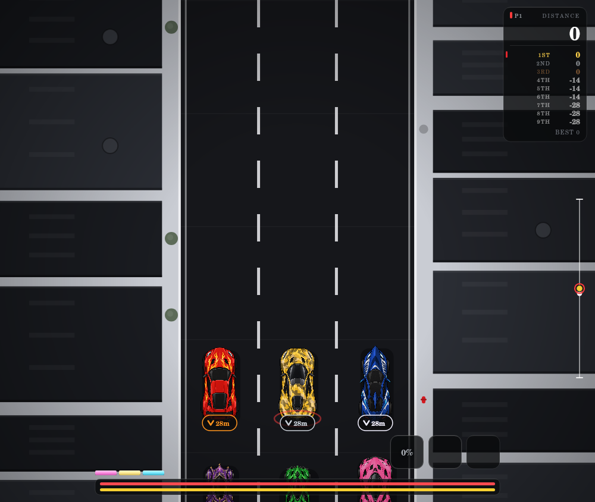
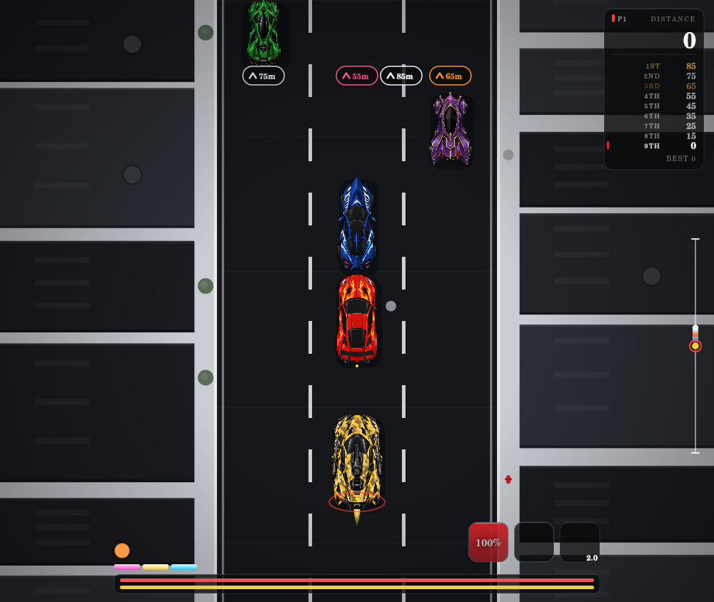
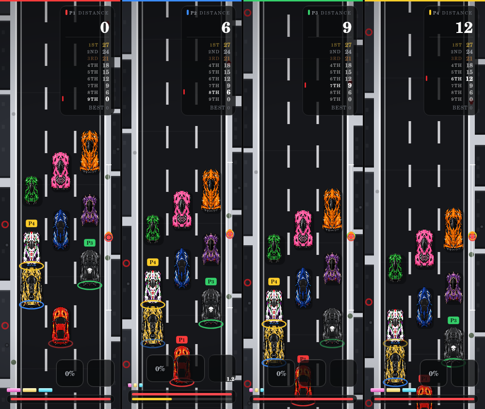

# Aureolin measurements and QA

Aureolin is the ninth racer. Both persistent forms use the original PNGs, unchanged. Physics, inputs, AI, local humans and rendering share the existing global-script architecture.

## Source measurements

Bounds below are `(x, y, width, height)` in source pixels. The alpha measurement uses `alpha >= 100`, excluding faint fringe pixels. `tools/aureolin-check.mjs` decodes the PNGs and checks these bounds directly. Collision hulls omit mirrors, narrow front/rear blades and exhaust tips; the armed hull includes the substantial side-launcher bodies.

| Model | Source dimensions | Solid alpha bounds | Race scale | Exhaust center |
| --- | --- | --- | --- | --- |
| Normal, `v_aureolin.PNG` | 1024 × 1536 | 149, 50, 726, 1398 | 1.10 | 512, 1410 |
| Armed, `vtm_aureolin.PNG` | 1024 × 1536 | 120, 35, 781, 1453 | 1.10 × 1.08 | 510, 1430 |
| Bullet, `vp_aureolinb.PNG` | 1254 × 1254 | 572, 82, 110, 1092 | Visible length: 0.20 normal Aureolin lengths | — |
| Rocket, `vp_aureolinr.PNG` | 1254 × 1254 | 486, 102, 282, 997 | Visible length: 0.34 normal Aureolin lengths | — |

The normal visible body is about 1.063 times shared `carW`; armed is about 1.188 times shared `carW`. Both belong to the same road-size pipeline as the other cars. Width and height always share one scale; transparent source padding remains in the rendered image.

### Weapon anchors

| Anchor | Source pixels | Stored normalized coordinates |
| --- | --- | --- |
| Turret muzzle | 509, 498 | `[509/1024, 498/1536]` |
| Left launcher opening | 161, 963 | `[161/1024, 963/1536]` |
| Right launcher opening | 858, 963 | `[858/1024, 963/1536]` |

The launcher artwork has its visible open ellipses at the lower ends of the side tubes. These measured openings are the launch points; rockets depart forward and smoothly steer toward the next eligible racer. They are separate points, including at positive/negative tilt. The turret muzzle is the forward tip of the central barrel, not the car center. `modelAnchorWorld()` applies the same measured bounds, uniform scale and rotation as `spriteFrame()`/`spriteAnchor()` and works before images load.

### Independent body polygons

The following source rows define the traced hulls. Each row is `y: left..right`, with a five-pixel inward offset applied to both sides. Walk the left column downward, then the right column upward. Thin decorative extremes are intentionally excluded. These two outlines are converted to independent `hitShape` arrays in `CARS.aureolin` and `altForm`; neither uses `CAR_HIT_RECT` or another racer's polygon.

```text
Normal:
65:361..662  100:295..728  150:243..780  200:195..828
300:176..847 400:185..838 480:209..814 620:219..804
750:215..809 900:199..825 980:185..839 1050:159..865
1150:149..874 1250:159..865 1300:189..834 1350:214..809
1395:286..737 1420:410..614

Armed:
65:413..610 110:273..750 200:179..842 300:156..864
400:160..861 480:175..846 600:199..824 640:143..879
750:132..889 900:124..897 980:126..895 1050:146..875
1150:132..888 1250:139..882 1300:161..858 1350:202..820
1400:257..765 1435:410..614
```

For bounds `(bx,by,bw,bh)`, let `k=min(1/bw,1.86/bh)`. A source point `(x,y)` becomes `[(x-bx-bw/2)*k, (y-by-bh/2)*k/1.86]` in logical car units. Tests verify every hull vertex lies on solid source alpha and check solid/transparent points under multiple sizes and tilts.

The bullet uses a slender six-point rounded-body approximation and the rocket a thirteen-point outline covering its body and fins. Their width is derived from the measured visible width/height ratio. Their oriented footprints sweep against the actual racer polygons and hazard outlines, including relative motion; the nearest contact wins. No broad circular racer collision proxy is used.

## Combat tuning and lifecycle

- Form switch: 2 seconds, same safety gates/whiteout/morph as Cole. Ordinary wrecks and finishes preserve form; new races reset it.
- Turret: 15 rounds/second; 1/60 capacity per shot; 60 shots from full in 4 seconds. Idle or locked recharge: 3.5 seconds from empty. Overheat unlocks only at full capacity.
- Bullet slow: each hit adds 0.10× for an independent 1.5 seconds. The factor is `max(0,1-0.10*n)`. It composes with all ordinary pace effects and clears on cleanse/wreck.
- Bullet range: 8 normal Aureolin lengths at 24 lengths/second; ultimate shots get exactly 2.00× range, fixed at launch.
- Ultimate: shared 85-second charge / 15-second duration / 2.0× pace. Refills heat, clears overheat and automatically fires armed weapons without heat drain. It does not force the armed form.
- Rockets: two simultaneous shots, 2.0-second cooldown, 16 lengths/second, 4.5 radian/second steering and 5-second lifetime. Dynamic closest-ahead targeting uses canonical progress, never camera height. Each contact removes exactly one half-shield; expiration has no splash damage.
- Flann ultimate absorbs; Verdant ultimate reveals only; Rhosyn ultimate is unreachable. Airborne Saffron escapes bullets but remains reachable by homing rockets.
- Projectiles destroy physical weeds, low/falling meteor bodies and oil they intersect. Puddles and pickups are excluded. Both Aureolin forms clear solid hazards during the ultimate, while puddles still affect the car.
- Mind Control clears all firing intents and blocks stale held controls until their own release. In-flight projectiles persist through control loss, form changes, ultimate expiry and owner wrecks; race exit/new race clear arrays.
- Projectile metres, travel distance and lifetime are simulation state. Camera movement/rebasing and split views never advance them. Pause freezes every weapon/debuff clock.

All tunable constants and projectile geometry are in `js/data.js`; the complete constant table is in [TUNING.md](TUNING.md#aureolin).

## Automated verification

The focused suite covers player one, bots and local humans; one-to-four-human full fields; form/cooldown/persistence gates; source alpha, sizing, anchors and tilted hulls; firing cadence at 20/30/60/144 Hz; heat/overheat; slow stacking/expiry/cleanse; ultimate auto-fire; touch, keyboard and all four controller seats; dynamic rocket targeting, actual homing contacts and shield depletion; every special ultimate interaction; hazard and moving-object sweeps; projectile rendering/cache/state purity; pause/reset; all nine starting polygons; localized menus, standings and footer geometry. It is imported by the ultimate suite.

Run all current executable checks:

```sh
node tools/check.mjs
node tools/menu-check.mjs
node tools/hitbox-check.mjs
node tools/sprite-check.mjs
node tools/progression-check.mjs
node tools/ultimate-check.mjs
node tools/shield-check.mjs
node tools/cole-check.mjs
node tools/dhaval-check.mjs
node tools/aureolin-check.mjs
```

`tools/game-fixture.mjs` is the shared fixture, not an additional check suite. The static check retains its informational warning about translation keys assembled at runtime.

## Render inspection and hardware checklist

The images below use the real game draw functions, original PNGs and a native Canvas implementation. The normal/armed size, nine standings rows, red-over-yellow meter order and per-seat footer separation were inspected. DOM/Canvas fixtures verify behavior and layout arithmetic. A browser executable was unavailable in the test environment, so these are native Canvas render captures, not browser screenshots; font metrics and some Path2D-only icons are not browser-faithful.





For a physical browser/device pass, check a downward touch drag/release/cancel, a simultaneous steering gesture, all four connected controller seats, keyboard release after Mind Control, and portrait/landscape safe-area insets. Confirm the DOM meter is announced as capacity/overheat and the switch button identifies the current normal/armed form in English and French. Hardware input and browser accessibility-tree behavior require that separate manual pass.
