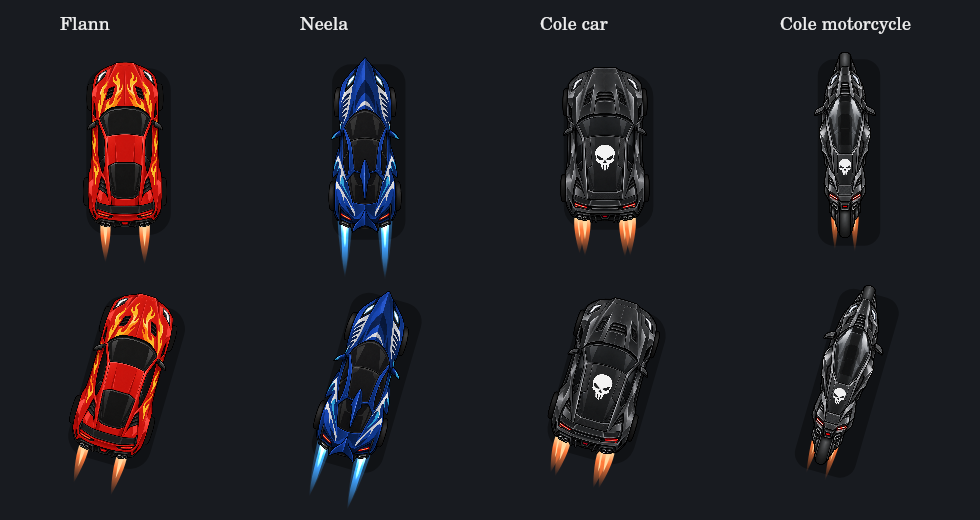
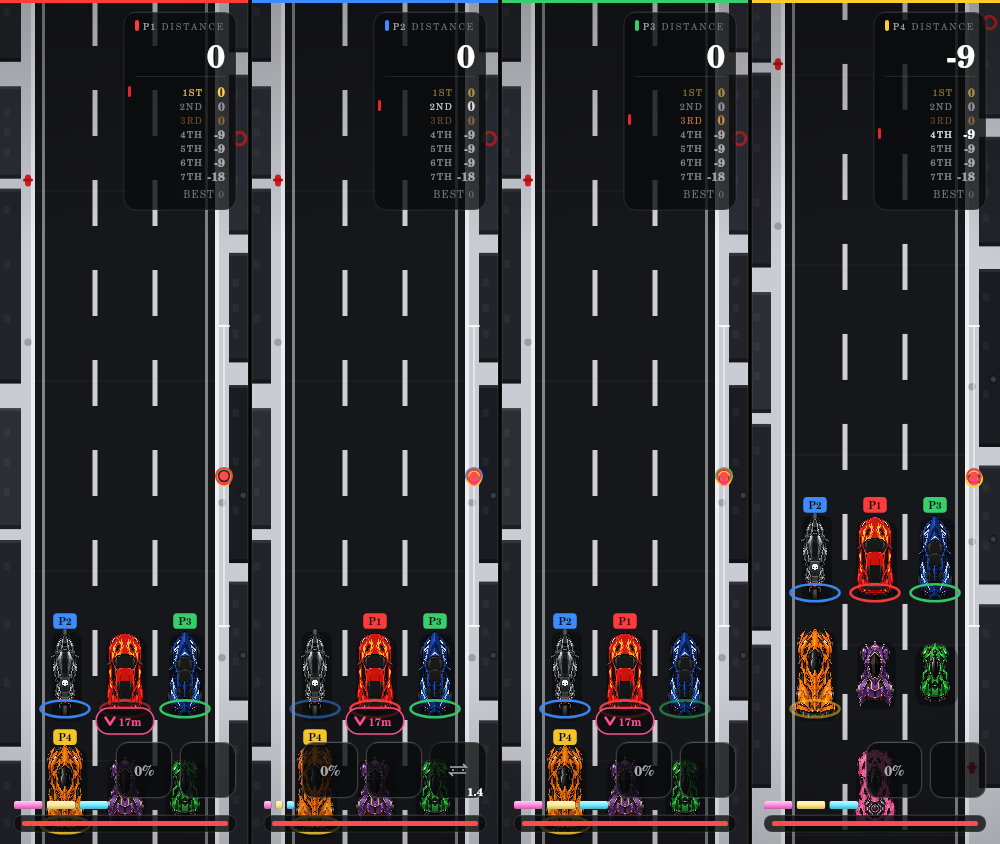

# Cole implementation and verification

Cole is one racer with two permanent vehicle forms. `switchColeForm()` gates all input routes; `racerModel()` selects the body used by drawing, collision, dimensions and exhaust. `racerPace()` centralizes the shared speed calculation. Only new-race initialization resets Cole to car form.

## Independent sprite measurements

Bounds exclude low-alpha fringe and detached pixels (solid alpha > 127). Coordinates below are source pixels; data stores normalized source coordinates. Hull vertices trace each body and its wheels independently and are converted through the same uniform fit used by `spriteFrame()`. Car mirrors and diffuser tips are excluded as decorative extremities; bike hulls include the wheel/body and mirror silhouette. Neither uses the generic rectangle.

| Model | Image size | Solid bounds, x/y/width/height | Exhaust bore centers | Scale |
| --- | --- | --- | --- | --- |
| Car | 1254 × 1254 | 276, 14, 702, 1222 | (428,1195), (470,1201), (783,1201), (825,1195) | race 1.12 |
| Motorcycle | 1247 × 1261 | 415, 4, 420, 1255 | (557,1048), (691,1048) | alternate 1.12 × race 1.12 |

The car artwork is four pipes in two pairs; the bike has two outlets. Every plume uses the standard fire pipeline with its own measured anchor. Cole never receives Flann’s body-fire overlay.



The bike is intentionally narrower and slightly longer than the car. Both keep the PNG’s original aspect ratio. This comparison was rendered through the real `drawCar()` implementation using a native Canvas backend, with decoded source pixels.

## Automated coverage

Run all seven existing commands plus the focused suite:

```sh
node tools/check.mjs
node tools/menu-check.mjs
node tools/hitbox-check.mjs
node tools/sprite-check.mjs
node tools/progression-check.mjs
node tools/ultimate-check.mjs
node tools/shield-check.mjs
node tools/cole-check.mjs
```

The focused suite is also imported by `ultimate-check.mjs`. Coverage includes all driver types, seven-car and 2/3/4-human fields, input gating, mixed HUD/Q/L1 cooldown attempts, held input, pause, respawn and finish persistence, form-aware stacking and smoothing, hazards in both forms, Mind Control, per-seat whiteout, bot switching, localized HUD, custom rules, starting overlap, and parking visibility. Geometry tests check solid and transparent source points under positive/negative tilt and confirm equality of player/rival hulls. Sprite tests check actual bore roots at several scales/tilts and preserve uniform scaling. Existing regressions remain enabled.

## HUD and local view inspection



This is the real Canvas renderer at 250-pixel local column width with Cole’s cooldown visible only in seat two. Seven standings rows, reserved action width, shield space and edge markers are exercised at narrower widths by tests. The DOM uses the same action count and size calculation; non-Cole standard actions remain two 56-pixel squares. A disabled item or ultimate reclaims its space.

The selection grid keeps three columns and centers the seventh card. All English and French descriptions and seventh-place labels are present.

## Validation limits

Canvas images were inspected; automated DOM/controller checks use the repository’s test doubles. A browser layout run could not be completed because no Chromium executable was installed and its download timed out. Physical controllers and real-device browser layout remain unverified. Follow-up manual checks: mobile portrait/landscape selection and HUD, high contrast/reduced motion, and L1 input on a physical controller with 2–4 local players.
