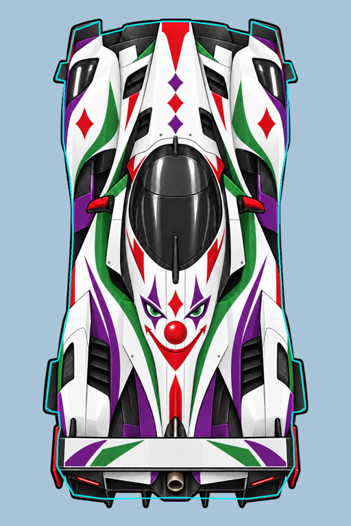
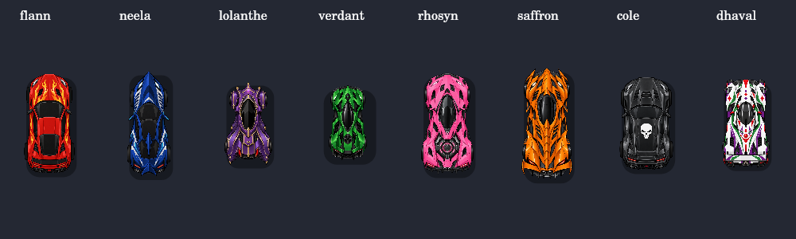
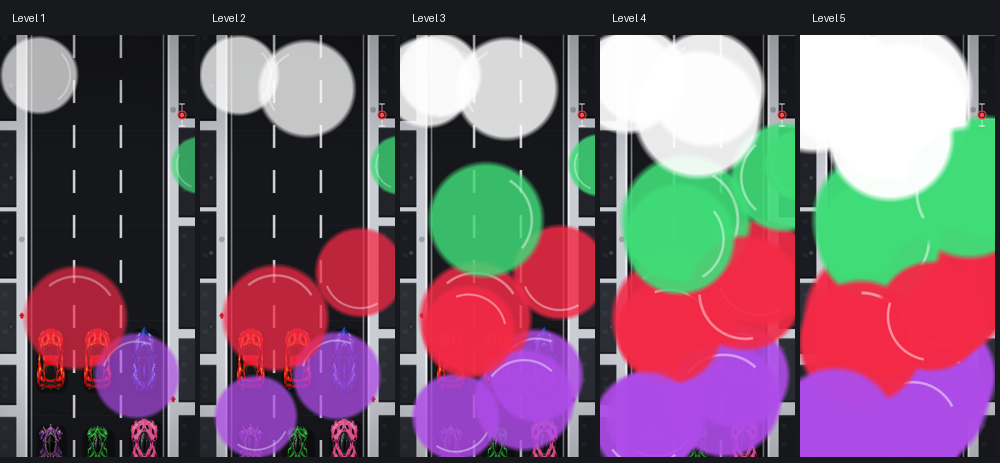

# Dhaval integration and QA

## Measured source geometry

- Asset: root `v_dhaval.PNG`, unchanged, 1024 × 1536 RGBA.
- Solid-alpha threshold: alpha > 127. Inclusive bounds: (125,54)–(898,1483).
- Normalized `spriteBounds`: `[125/1024,54/1536,774/1024,1430/1536]`.
- Visible centre: (512,769). The entire sheet is rendered; bounds only fit and centre it.
- Road scale: default **1.0**. At a logical 100 × 186 car box, the body is
  100 × 184.75, already the same lane class as Lolanthe. No independent stretching.
- One tailpipe: circular bore centre (512,1416). The original sprite is cached once.
- Independently traced 61-point hull: crown/nose, front shoulders, wheel/fender
  extents, narrow waist, rear wheels, wing structure and rear body. Black outline
  fringes, trailing diffuser teeth and rear ornamental endplate tips are excluded.
  Source points map to logical units by `(x-512)/774`, `(y-769)/(774*1.86)`.
- The geometry is available before image decode and uses the shared `racerModel`,
  `racerDims` and `carHit` transform for every driver.





## Rules and interactions

The aura runs once after all movement, before Lolanthe’s aura. Its longitudinal
range follows the existing Lolanthe convention: four canonical shared car lengths.
Standard charge (85 seconds), duration (15 seconds), and pace (2×) are unchanged.

| Target or event | Result |
| --- | --- |
| Eligible nearby opponent | Level 1; three-second timer |
| Remaining/re-entering before expiry | Refresh to three seconds, retain level |
| Leaving range | Tail expires, level and visual age clear |
| Accepted weed/puddle contact | +1 level, maximum 5; shield contact counts |
| Meteor hit | Accepted hit escalates; ensuing wreck clears all debuffs |
| Repeated puddle overlap, near miss, Perfect Dodge | No extra escalation |
| Hazard destroyed by target’s ultimate | No escalation |
| Wrecked, finished, Invulnerable or isolated racer | No application |
| Ulting Rhosyn | Immune; activation clears old Dhaval state; no Aero-Glow lights |
| Ulting Verdant | Immune; activation clears old Dhaval state; still physical |
| Ulting Lolanthe | Convert attempted Obscurity into refreshed Cleansed |
| Cleansed | Clear Slow, water, Dhaval lights/level, Skid and Mind Control; block new debuffs |
| Cleansed collision | Still displaces, loses shield durability, and can wreck |
| Ulting Dhaval against weed, meteor body, puddle | Remove hazard, no ordinary consequence or ultimate penalty |
| Item oil | Remains an item effect; Dhaval does not delete it |

Puddle water and Dhaval’s state remain independent, with one canonical Obscured
badge. Cosmetic transformation whiteouts keep their existing presentation badge;
Cleansed does not interrupt a transformation. Wreck, finish, leave and race reset
clear Dhaval state; wreck/finish/leave/reset also clear the Cleansed timer.

## Visual verification

The actual game renderer was exercised with a native Canvas backend and the real
PNG assets. These are Canvas renders, **not browser screenshots**. The montage
shows severity at the same simulation age. The fixed spatial sequence gives all
cars the same coverage; each victim owns its age and severity independently.



Large circles use white, purple, red and green. Slow drift and rotating sweep arcs
make motion visible. Staggered multi-second growth/retirement creates pop-ins
without synchronized flashes. Higher levels retain and enlarge earlier circles,
add circles, and raise opacity. Reduced motion freezes the same geometry at one
representative age; it does not remove the obstruction.

Measured mean alpha coverage, averaged over 12 simulation ages (0–11 seconds),
including feathered edges. This is a reproducible coverage proxy, not a claim
that perceived obstruction has an exact percentage.

| View | Motion | L1 | L2 | L3 | L4 | L5 |
| --- | --- | ---: | ---: | ---: | ---: | ---: |
| 390 × 844 | Full | 16.4% | 35.6% | 55.6% | 79.1% | 90.3% |
| 390 × 844 | Reduced | 15.9% | 34.9% | 57.7% | 82.0% | 91.5% |
| 200 × 844 | Full | 16.2% | 33.7% | 54.0% | 78.5% | 92.3% |
| 200 × 844 | Reduced | 15.7% | 33.2% | 55.2% | 81.3% | 94.7% |
| 700 × 844 | Full | 16.3% | 35.7% | 54.3% | 75.6% | 86.5% |
| 844 × 390 | Full | 15.7% | 32.9% | 49.2% | 69.5% | 84.7% |

The overlay clips its own view, remains inside the split-screen clip, and is
painted before the ladder/seat HUD. Bots carry the status without creating any
human overlay. Rendering neither advances timers nor mutates gameplay state.

## Automated evidence

Run from the repository root, with plain Node and no installation:

```sh
node tools/check.mjs
node tools/menu-check.mjs
node tools/ultimate-check.mjs
node tools/sprite-check.mjs
node tools/hitbox-check.mjs
node tools/cole-check.mjs
node tools/progression-check.mjs
node tools/shield-check.mjs
node tools/dhaval-check.mjs
```

All nine commands passed on this change. Counts: menu 97, ultimate 345, sprite 49,
hitbox 37, Cole 24, progression 40, shield 35, Dhaval 38. The invariant checker
reports no failures or missing translations (one pre-existing informational warning).

The ultimate suite also imports Cole, progression and Dhaval checks. Coverage
includes all player/bot/local target roles; aura refresh, expiry and counters;
actual accepted hazard paths; cleanse/contact separation; AI sight/valuation;
1–4 viewport ownership; reduced-motion coverage; render purity; measured geometry;
full fields, distinct spawn/parking marks, EN/FR menus and direct selection.
The sprite suite runs a three-minute full-field simulation.

The former six-rival spawn arrays were extended to seven slots. The regression
suite checks finite positions and non-overlapping starting/parking hulls for the
full eight-car roster.

## Remaining manual browser/controller QA

Live browser checks could not be completed in this environment: the connected
browser refused the local preview URL, and the standalone browser binary download
timed out. No physical controllers were available. Native Canvas inspection and
DOM/Canvas test doubles do not prove browser layout or physical input behavior.

Before release, play Dhaval as P1 and local P2/P3/P4 on desktop and phone-sized
layouts, inspect the eight-card showroom and eight-row HUD, and check levels 1–5
in motion and reduced motion. Check each special counter, hazard destruction,
and split-screen clipping while driving. No completed browser/controller QA is
claimed by this record.
